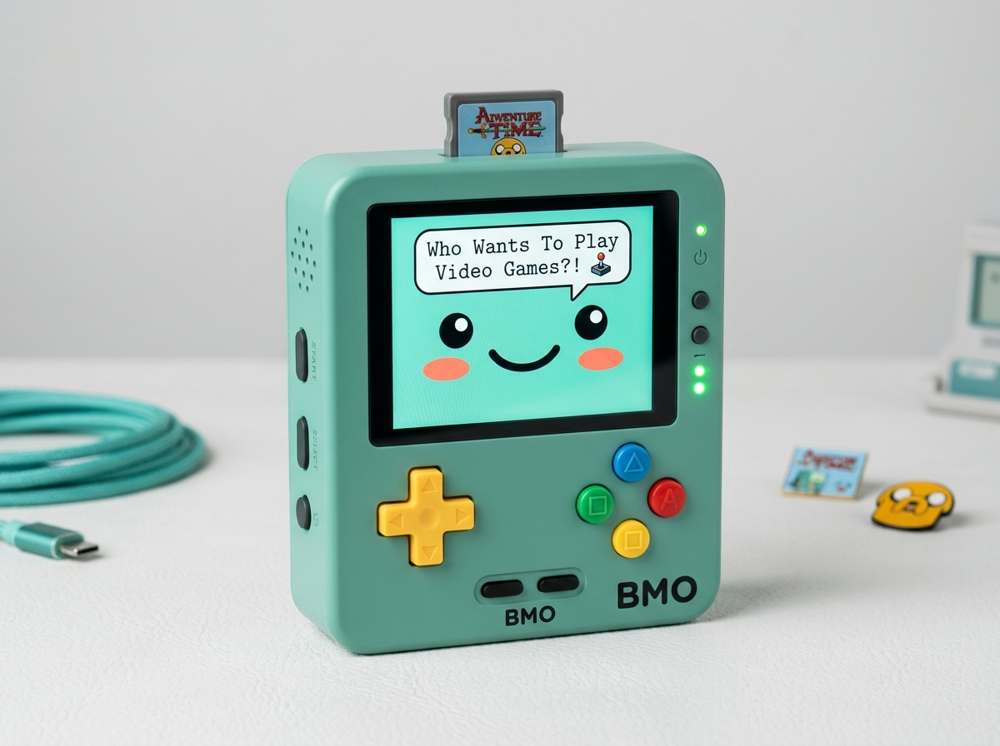
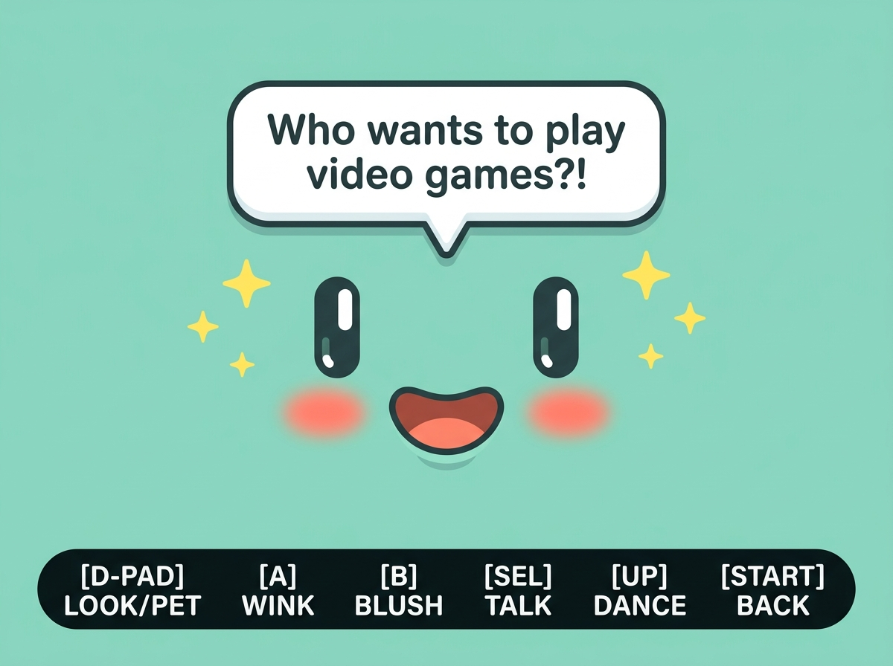
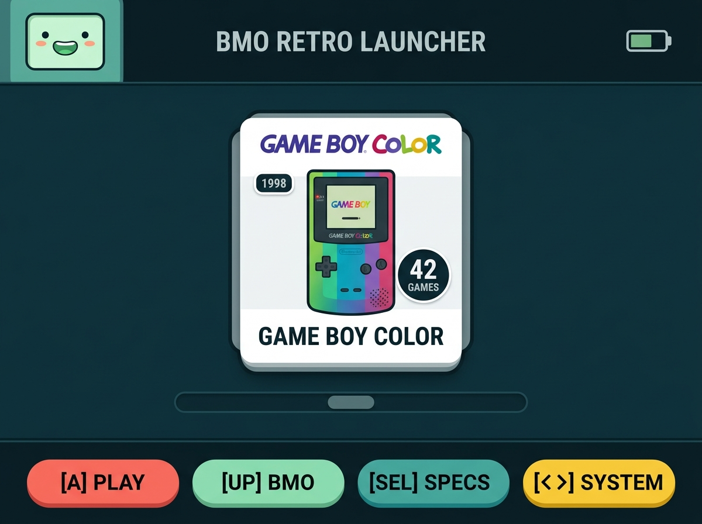
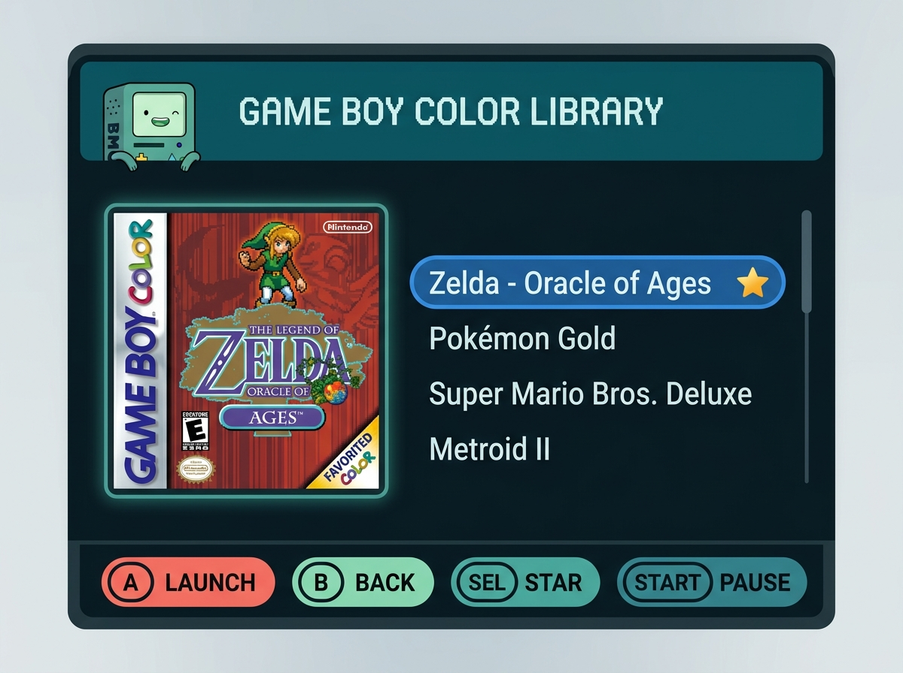
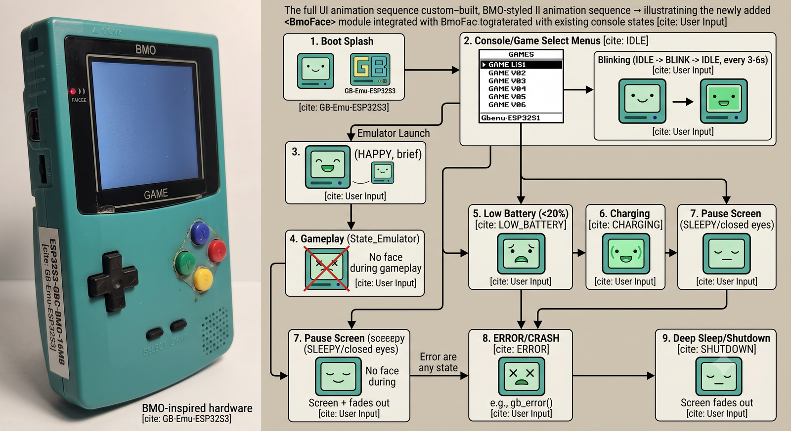

<div align="center">

# 🎮 ESP32-S3 Handheld Gaming Console (BMO Edition)

[](scripts/validate_repo.py)
[](https://www.espressif.com/)
[]()
[]()
[]()
[]()

A high-performance retro gaming handheld console powered by the **ESP32-S3**, featuring an authentic **Living 2D Vector BMO Mascot Companion** engine, a 14-core retro emulation suite (Game Boy, Game Boy Color, NES, Sega Master System, DOOM, and more), high-speed SD indexing, and Apple/Nintendo-inspired UI ergonomics.

<br/>



<br/>
<br/>

</div>

## 📸 System Showcase & Visual Artifacts

### 🤖 Living BMO Mascot Companion (2026 Edition)
> Real-time procedural 2D Signed Distance Field (SDF) vector mascot with 2nd-order harmonic spring physics, dynamic typewriter speech bubbles, 16-expression emotion matrix, interactive tickling/petting, and 125 BPM musical dance party groove. Zero internal DRAM overhead (native 320×240 Octal PSRAM rendering).

<div align="center">
  
  <p><em>Living BMO Mascot Companion with organic typewriter speech bubbles, star rhythm sparkles, and Nintendo-style glanceable controls.</em></p>
</div>

---

### 🕹️ Multi-System 3D Carousel Launcher & Apple/Nintendo Ergonomic UI
> Smooth spatial navigation across 14 retro console architectures. Features Nintendo-grade glanceable physical button pills (`[A] PLAY`, `[UP] BMO`, `[SEL] SPECS`, `[< >] SYSTEM`), continuous scroll tracks, and ambient header mascot tracking.

<div align="center">
  
  <p><em>Multi-System Console Carousel Launcher featuring Nintendo-style physical button badges and glanceable specs.</em></p>
</div>

---

### 📚 Retro Game Library & Box Art Browser
> Instant catalog browsing supporting 10,000+ ROMs with sub-15ms boot cache indexing, real-time 64×64 cover art decompression, universal multi-console favorites starring (`★`), and animated BMO glance reactions.

<div align="center">
  
  <p><em>Retro Library with streaming cartridge cover art, favorited game badges, and spatial list scrollbar.</em></p>
</div>

---

### ⚡ Physical Hardware & Operating States

<div align="center">
  
  <p><em>Physical soldered ESP32-S3 perfboard hardware alongside core system states: Boot Splash, Console Carousel, Game Library, and In-Game Emulation.</em></p>
</div>

---

## Key Highlights

- **Hardware Platform:** ESP32-S3-N16R8 (Dual-Core LX7 @ 240MHz, 16MB OPI Flash, 8MB Octal PSRAM).
- **Display Pipeline:** ST7789 240×320 SPI TFT (Landscape 320×240) @ 80MHz SPI with Core 0 dedicated FreeRTOS display worker, double-buffered PSRAM canvases, and SpiArbiter bus safety.
- **Save States & Battery RAM:** Multi-slot non-volatile save states (slots 1–5) and battery-backed SRAM persistence (`.sav`) protected by FreeRTOS SPI bus arbiter, CRC32 verification, and in-game quick pause overlay.
- **High-Speed Cache & Box Art:** Binary ROM fast-cache (`.bmo_index`) reducing 2,000-ROM enumeration from ~3.5s to < 15ms, with 64×64 retro box art cover streaming from SD card.
- **Mascot Face Engine:** Procedural 2D Signed Distance Field (SDF) mathematical renderer with analytic anti-aliasing and dynamic emotional expressions (`IDLE`, `HAPPY`, `SURPRISED`, `SLEEPY`, `LOW_BATTERY`, `CHARGING`, `ERROR`, `SHUTDOWN`).
- **Multi-Console Emulation:**
  - **Peanut-GB:** Game Boy DMG (`.gb`)
  - **Walnut-CGB:** Game Boy Color (`.gbc`) with custom CGB palette engine
  - **Agnes:** Nintendo Entertainment System (`.nes`)
  - **SMSPlus:** Sega Master System / Game Gear (`.sms`, `.gg`)
  - **doomgeneric:** Classic DOOM (`.wad`) with direct VFS streaming
- **Storage & Fallback:** Dual-ROM system supporting hot-swappable MicroSD cards and built-in flash-baked ROMs (Super Mario Bros. Deluxe, Zelda: Oracle of Ages) running seamlessly without an SD card.
- **AI-Compatible Agent Environment:** Strict governance rules, zero-context primers, symbol verification tables, and anti-pattern registries under [`.agents/rules/`](file:///e:/BMO%20Gameboy/.agents/rules/README.md).

---

## Documentation Quick Links

- [**Software Design Document (SDD v3.6)**](file:///e:/BMO%20Gameboy/docs/software-design-document.md) — Authoritative living architectural specification covering hardware ground truth, state machine, memory layout, rendering pipeline, emulator contracts, and AI governance.
- [**Agent Quick-Start Primer**](file:///e:/BMO%20Gameboy/.agents/rules/31_quick_start_primer.md) — 90-second on-ramp and decision matrix for autonomous coding agents and human contributors.
- [**Hardware Notes & Lessons Learned**](file:///e:/BMO%20Gameboy/docs/hardware-notes.md) — Board-level wiring, pin restrictions, and power notes.
- [**Changelog**](file:///e:/BMO%20Gameboy/CHANGELOG.md) — Repository version history and milestone tracking.
- [**Agent Manifest**](file:///e:/BMO%20Gameboy/AGENT_MANIFEST.json) — Machine-readable hardware and build metadata.

---

## Repository Structure

```text
repo-root/
├── README.md                          <- Project overview & quick start
├── CHANGELOG.md                       <- Human-readable version history
├── AGENTS.md                          <- Entry point for AI coding agents (Ruleset v5)
├── AGENT_MANIFEST.json                <- Machine-readable project metadata
├── docs/                              <- Specifications & hardware notes
│   ├── software-design-document.md    <- Living reviewer-grade SDD (v3.0)
│   └── hardware-notes.md              <- Pin restrictions & electrical notes
├── .agents/
│   └── rules/                         <- Topic-specific modular agent rules (37 rules)
│       ├── 00_hard_stops.md           <- Non-negotiable hardware safety rules
│       ├── 01_hardware.md             <- Verified pin map & physical state
│       ├── 10_symbol_reference.md     <- Verified public symbol lookup table
│       ├── 27_codebase_map.md         <- System architecture & memory map
│       ├── 30_common_agent_mistakes.md<- Institutional anti-pattern catalogue (M1-M20)
│       ├── 31_quick_start_primer.md   <- 90-second zero-context on-ramp
│       ├── 35_bmo_face_contract.md    <- Procedural mascot renderer contract
│       ├── 36_bug_intake_protocol.md  <- Structured hardware bug intake protocol
│       ├── 37_rom_governance_and_flash_budget.md <- ROM tracking & flash budget invariant
│       └── CONTEXT_INDEX.json         <- Machine-readable task-to-rule map
├── firmware/
│   └── BmoGameboy/                    <- Main Arduino sketch directory
│       ├── BmoGameboy.ino             <- State machine, loop(), frame timing
│       ├── partitions.csv             <- Custom 8MB app0 partition table
│       └── src/
│           ├── core/                  <- Hardware drivers (display, buttons, SD, face)
│           ├── emulators/             <- Thin glue wrappers (peanut, walnut, nes, doom)
│           ├── engine/                <- Header-only emulator engines (walnut_cgb)
│           ├── vendor/                <- Upstream libraries (peanut_gb, agnes, doom)
│           └── assets/                <- Assets & baked flash ROM headers
├── tools/                             <- Host desktop test harness (Zig)
└── scripts/                           <- AI Guardian validation & asset pipeline
```


---

## Firmware Build & Flash

### Prerequisites
1. **Arduino CLI** or **Arduino IDE** with ESP32 board support (Core v3.3.11).
2. Libraries: `Adafruit_GFX`, `Adafruit_ST7789`.

### Build Command (Arduino CLI)
```powershell
.\arduino-cli.exe compile --fqbn "esp32:esp32:esp32s3:CDCOnBoot=cdc,FlashMode=qio,FlashSize=16M,PartitionScheme=custom,PSRAM=opi" firmware/BmoGameboy
```

> [!IMPORTANT]
> The module is an ESP32-S3-WROOM-1 (N16R8) with Quad SPI Flash and Octal SPI PSRAM. Always compile with `FlashMode=qio` and `PSRAM=opi`. Setting FlashMode to OPI will cause a black screen / flash cache fault.

---

## Tooling & Verification Pipeline

1. **Repository Health Check:**
   ```bash
   python scripts/validate_repo.py
   ```
2. **Python Test Suite:**
   ```bash
   python -m unittest discover -s tests -v
   ```
3. **Validation Benchmark:**
   ```bash
   python scripts/benchmark_repo.py
   ```
4. **ROM Integrity Verification:**
   ```bash
   python scripts/test_runner.py
   ```

---

## License

MIT - see [LICENSE](LICENSE).
